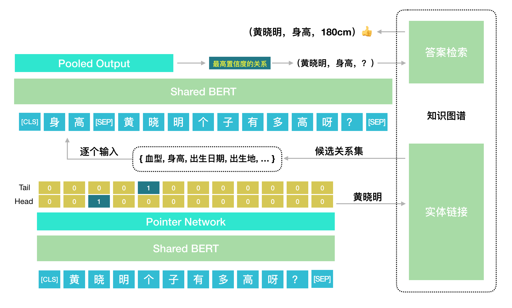

# 百科KBQA
一个基于知识图谱的端到端问答系统，分为实体识别和关系分类两部，在BERT基础上做多任务联合训练。

## Definition
三元组：包含主谓宾，格式形如`（subject, predicate, object）`的数据；
问题：也称query，该项目中的问题一般都是询问宾语；
知识图谱：包含大量三元组的知识库，在该项目中为百科知识。

## Introduction
本项目实现了一个基于BERT的端到端的KBQA系统，支持单跳问题的查询。主要分为两个部分：
1. 实体识别：输入一个问句，找出该问句的唯一核心实体(subject)；
2. 关系检索：输入一个问句和一个关系，判断该问句是否询问了该关系(predicate)。

## Data
Knowledge Graph:
[NLPCC 2017图谱(提取码：khrv)](https://pan.baidu.com/s/1yO77WW5XQwA_RtkxRHI7Yw)

QAs:
[NLPCC 2016KBQA](https://github.com/fyubang/Joint-BERT-KBQA/tree/master/data)

